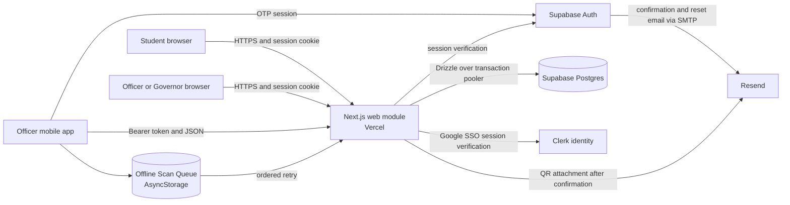
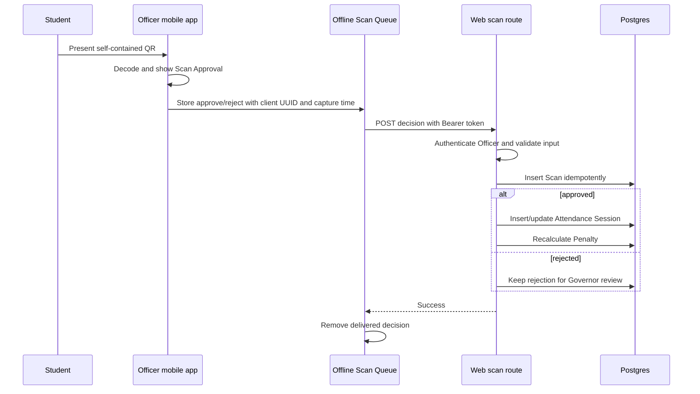
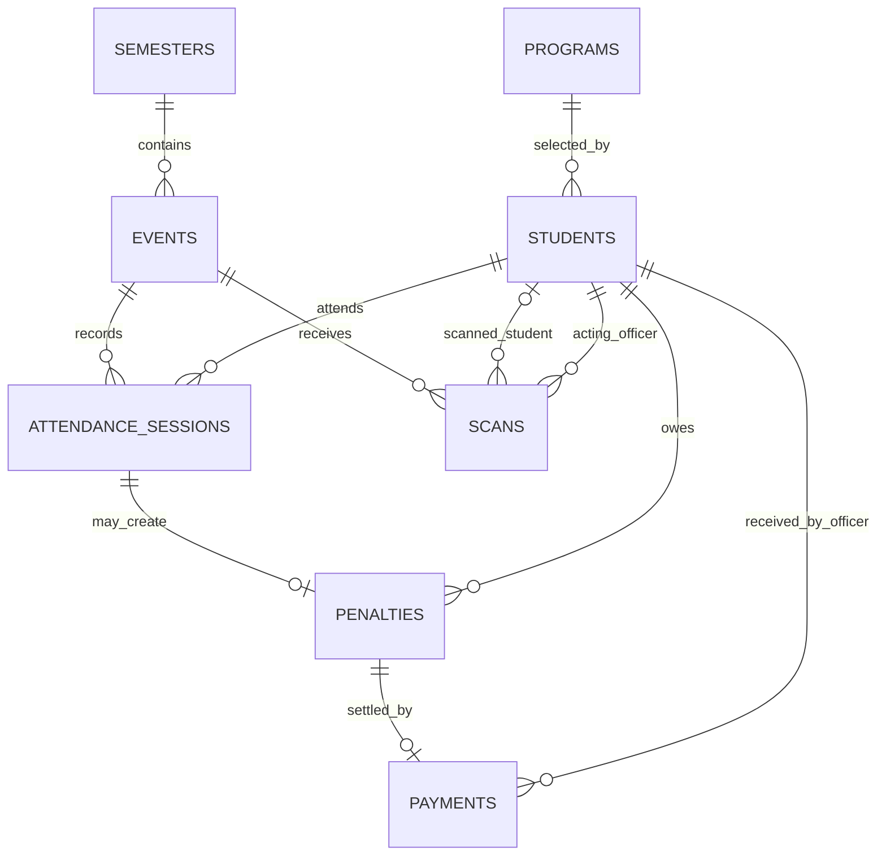

# CCS Attendance Architecture

Last updated: 2026-07-31

## Purpose

CCS Attendance replaces paper sign-in sheets with QR-based attendance, per-Semester Penalty tracking, Payment records, and Clearance checks for the College of Computer Studies.

The repository is a pnpm/Turborepo monorepo with three runtime-facing modules:

- `apps/web`: responsive Next.js web application and server-side `/api/*` routes
- `apps/mobile`: Expo/React Native Officer booth application
- `packages/db`: shared Drizzle schema, database client factory, and migrations

## Runtime topology

## Architectural seams

| Module | Interface | Implementation | Seam and adapters |
| --- | --- | --- | --- |
| Web delivery | Pages, server actions, and `/api/*` routes | Next.js App Router in `apps/web` | Cookie-backed browser adapter and Bearer-token mobile adapter |
| Authentication | Valid external identity mapped to one Student row | Clerk on web, Supabase Auth on mobile, both keyed by `students.auth_user_id` | `lib/auth.ts` adapts Clerk sessions; `lib/api-auth.ts` adapts mobile Bearer tokens |
| Role policy | Capability decisions for Student, Officer, and Governor | One capability matrix used by commands, guards, and navigation | Cookie and Bearer adapters authenticate; deep modules authorize |
| Event lifecycle | Create, update, and delete shared Events | Three commands own capability, Semester, lifecycle, and persistence rules | Web and mobile are two adapters at the same seam; listing remains a read query |
| Scan Approval | Apply one approve/reject decision | One command owns validation, idempotency, transaction, attendance resolution, and Penalty synchronization | The mobile queue is the delivery adapter; Postgres is the durable backend |
| Ledger | Per-Student standing and per-Event operations projections | `computeLedger`, `studentLedger`, and `semesterLedger` | A deep module: one read interface hides virtual no-shows and rollups |
| Attendance correction | Present/Absent edits and Payment recording | Event attendance grid actions | Manual edits store a noon sentinel; booth scans store the real capture time |
| Persistence | Typed schema and query access | Drizzle ORM, postgres-js, committed SQL migrations | `createDb(connectionString)` is the database interface |
| Messaging | Booth OTP email and verified Student QR delivery | Supabase SMTP (mobile) and Resend SDK | Resend is the external adapter |

## Approved target interfaces

- Scan Approval: one command receives the authenticated actor and decision, then hides capability checks, canonical Student matching, strict idempotency, the database transaction, Time-in/Time-out resolution, and Penalty synchronization.
- Event lifecycle: three plain commands create, update, and delete Events; browser and mobile adapters translate transport input/output only.
- Offline Scan Queue: enqueue, synchronize, discard, and read state; Officer identity, AsyncStorage, retry classification, and backoff remain inside the module.
- Role policy: one display predicate and one required-capability check; authentication remains in the existing cookie and Bearer adapters.

## Platform and role split

| Capability | Student | Officer | Governor |
| --- | --- | --- | --- |
| Sign in with a school Google account and onboard | Web | Web/mobile after promotion | Web, with the email on the Governor allowlist |
| View own QR, attendance, Penalties, Payments | Web | Web | Web |
| View operations dashboard | No | Web | Web |
| Create and manage shared Events | No | Web/mobile | Web/mobile |
| Scan attendance | Presents QR | Mobile | Mobile |
| Correct attendance, record Payments, check Clearance | No | Web desktop | Web desktop |
| Manage Semesters and Programs | No | No | Web |
| Promote Students to Officer | No | No | Web |
| Review rejected scans | No | No | Web |

Officers share every Event; there is no per-Officer Event ownership. Governors inherit every Officer permission, including the native booth, and add the ADMIN capabilities. Governors promote Students to Officer; demotion is outside the current domain because it can strand device-only Scan Approval decisions.

## Main data flow

The target command binds each client UUID permanently to one unchanged decision. A repeated identical decision returns its completed result; reuse with different content returns `409 Conflict`. Approved Scan, Attendance Session, and Penalty changes commit in one transaction, and any failure leaves the mobile decision queued.

## Data model

Key invariants:

- One Attendance Session exists per Event, Student, and AM/PM half.
- Both Time-in and Time-out are required for an Attendance Session to be present.
- One Penalty exists per absent Attendance Session and is recalculated from attendance.
- One Payment settles one Penalty in full; Payments are insert-only.
- An Event belongs to one Semester and one Asia/Manila calendar date.
- A Student registered before a Semester ends owes for every Event in that Semester.
- Event deletion cascades through its Scans, Attendance Sessions, Penalties, and Payments.

Approved lifecycle additions:

- Postgres enforces at most one open Semester.
- Semester date changes cannot exclude an existing Event.
- An Event may be deleted only while its Semester is open and before any Scan or Attendance Session exists.
- After attendance begins, only Event name and venue remain editable.
- Semester closure freezes Event definition and existence, while Attendance correction and Payment recording remain available.
- Multiple approved booth decisions resolve to the earliest Time-in and latest Time-out, regardless of delivery order.

## Authentication and authorization

1. Web sign-in is Clerk with Google SSO restricted to the school domain (ADR-0012); no password is ever collected or stored.
2. A signed-in person with no Student row is a Pending Student: onboarding creates the row keyed by the Clerk user id, assigns Governor only when the email is in `GOVERNOR_EMAILS`, and sends the QR attachment.
3. Browser requests carry the Clerk session cookie.
4. Mobile requests send a Supabase access token as `Authorization: Bearer`.
5. Every privileged page, action, and route rechecks the role server-side.
6. The sidebar caches identity in `localStorage` only to render navigation; it cannot grant access.

## Ledger and Penalty behavior

The Ledger module has high depth: its small read interface produces Student standing, Event statistics, and Semester totals while hiding the implementation of virtual no-shows, late registration liability, payment matching, and Asia/Manila date handling.

Most reads do not write. Full no-shows are projected virtually until an Officer opens an Event attendance table, where payable Attendance Session and Penalty rows are materialized idempotently.

## Deployment topology

- Web and `/api/*`: Vercel, root directory `apps/web`
- Web identity: Clerk with Google SSO; Postgres: Supabase
- Database access: Supabase transaction pooler with prepared statements disabled
- Booth OTP SMTP and QR email: Resend
- DNS/custom domain: Cloudflare in front of the Vercel domain
- Native booth app: Expo/React Native build configured against the same Supabase project and public web base URL

See [deployment.md](./deployment.md) for the release path.

## Approved refactor scope

- Make Scan Approval persistence atomic and reject conflicting UUID reuse.
- Reject unreadable or non-canonical QR data from approval; retain the attempt as a rejection.
- Consolidate Event mutation rules behind the Event lifecycle commands and database constraints.
- Partition Offline Scan Queue state by Supabase user ID, classify retryable versus permanent failures, move permanent failures to Needs Review, continue later delivery, and block logout until all decisions are delivered or discarded.
- Keep Recent Scans as an independent five-item local read model.
- Centralize capabilities, return `401` for missing identity and `403` for denied capability, allow Governors on mobile, and reject Students before booth tabs render.
- Verify Scan Approval and Event lifecycle through a disposable Postgres database; keep queue and role-policy checks as focused unit tests.

Out of scope: mobile Payment UI, desktop viewport gating, Officer demotion, digital Clearance signing, background-task infrastructure, and QR signing. Clearance continues to report readiness for a physical paper signature.

## Related decisions

- [ADR 0001 — Supabase, Drizzle, Turborepo, Vercel, and Expo](./adr/0001-supabase-and-web-mobile-stack.md)
- [ADR 0003 — Email and password authentication](./adr/0003-password-auth-instead-of-magic-link.md) (superseded by ADR 0012)
- [ADR 0006 — Mobile/web platform split](./adr/0006-mobile-web-platform-split.md)
- [ADR 0007 — Shared Officer Events](./adr/0007-officers-share-all-events.md)
- [ADR 0008 — Full-Semester late-registration liability](./adr/0008-late-registrants-owe-full-semester.md)
- [ADR 0009 — Manual attendance sentinel](./adr/0009-manual-attendance-edits-carry-a-sentinel-not-a-real-time.md)
- [ADR 0010 — Governors may use the mobile booth](./adr/0010-governors-may-use-the-mobile-booth.md)
