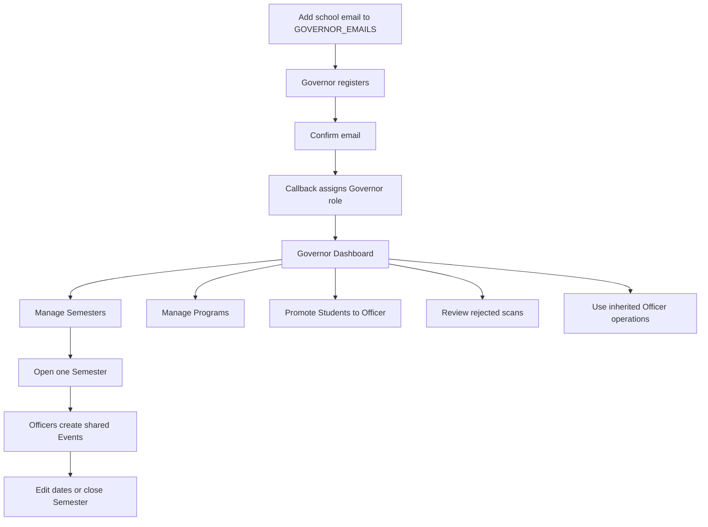

# Governor Flow

## Scope

A Governor inherits every Officer capability and adds the complete ADMIN surface: Semesters, Programs, Officer promotion, and rejected-scan review.

## Bootstrap

1. Add the Governor's normalized school email to the comma-separated `GOVERNOR_EMAILS` deployment variable before registration.
2. Register through the normal Student form.
3. Confirm the email.
4. The callback assigns `governor` when the confirmed email matches the allowlist.

The allowlist is evaluated when the Student row is first linked. Changing the variable later does not automatically rewrite existing roles.

## Semester administration

1. Open `/admin`.
2. Create a Semester with a valid start and end date.
3. Only one Semester can be open at a time.
4. Officers can create Events only within the open Semester's date range.
5. The Governor may edit Semester dates only when the new range still contains every existing Event.
6. Closing a Semester is irreversible through the interface.
7. Deleting a Semester succeeds only when no Event references it.
8. Post-closure Attendance correction and Payment recording remain available for reconciliation.

## Program administration

1. Add a unique Program name.
2. The registration form reads the current Program list.
3. Remove an unused Program when needed.
4. Removal fails when Students still reference the Program.

## Officer administration

1. Search by Student name, email, or Student ID.
2. Confirm promotion to Officer.
3. The promoted account gains shared Event, booth, Payment, attendance-correction, and Clearance access.

Officer demotion is outside the current domain because device-only Offline Scan Queue decisions cannot be handed off safely.

## Rejected Scan Approval review

1. Open `/admin/rejections`.
2. Filter by Student or QR reference.
3. Sort by Student or scan time.
4. Review the resolved Student, raw QR payload, acting Officer, and device capture time.

Rejected decisions never alter an Attendance Session.

## Inherited Officer work

The Governor can also use the web Dashboard, shared Event operations, attendance correction, Payment recording, Clearance lookup, and the native mobile booth. Students who sign into mobile are rejected before booth tabs render.

## Exceptions and controls

| Situation | Outcome |
| --- | --- |
| Email is absent from `GOVERNOR_EMAILS` at first confirmation | Account is linked as Student |
| Another Semester is open | New Semester creation is blocked |
| Semester has Events | Semester deletion is blocked |
| Program is referenced | Program removal is blocked |
| Officer demotion requested | Outside the current domain until safe queue handoff is required |
| Event already has attendance activity | Event deletion and attendance-defining edits are blocked |
