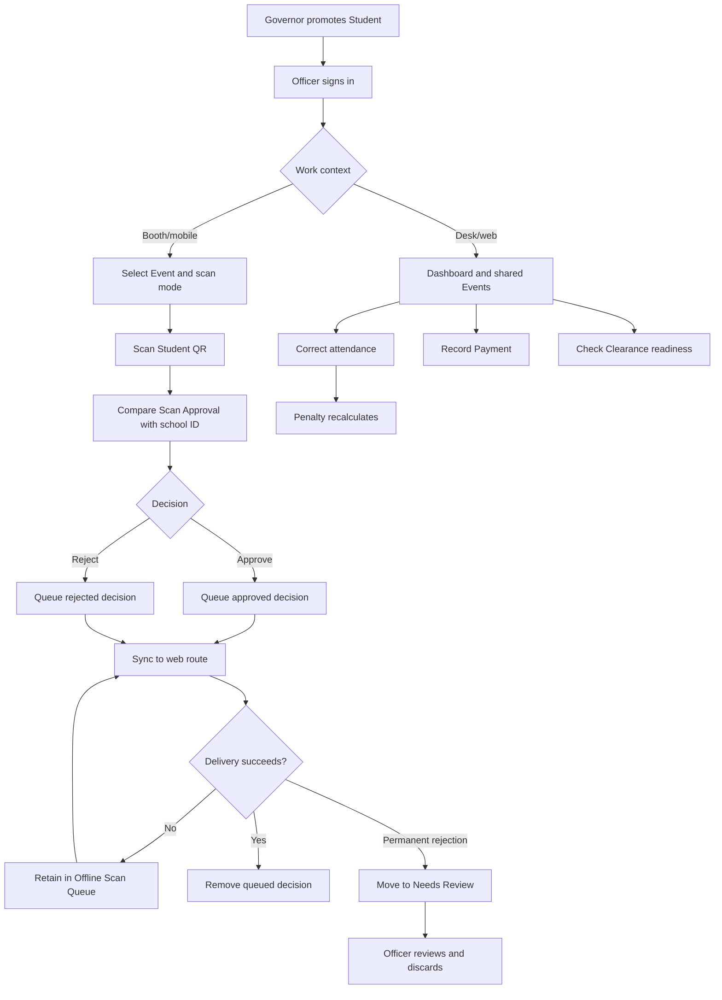

# Officer Flow

## Scope

An Officer is a promoted Student who operates shared Events. Mobile is the booth surface; web is the desk surface. Every Officer can act on every Event.

## Becoming an Officer

1. Register and confirm a normal Student account.
2. A Governor searches for the Student and promotes the role to Officer.
3. Sign in again or refresh the current session so role-aware navigation is refreshed.

Officer demotion is outside the current domain until safe Offline Scan Queue handoff is required.

## Mobile booth flow

1. Sign in to the Expo app with the confirmed email and password.
2. Select a shared Event.
3. Select one mode: Time-in AM, Time-out AM, Time-in PM, or Time-out PM.
4. Scan the Student QR.
5. Compare the displayed name, Student ID, and Program with the worn school ID.
6. Approve or reject:
   - approve targets an Attendance Session field;
   - reject records the decision without changing attendance.
   - unreadable or non-canonical Student details disable approval and are retained as a rejection.
7. The app stores the decision in the Offline Scan Queue with a client UUID and device capture time.
8. Queue state is partitioned by the signed-in Officer's Supabase user ID.
9. The app attempts delivery immediately, at startup, whenever connectivity returns, and with bounded exponential backoff while open.
10. On success, the queue removes the item.
11. Network, timeout, `429`, and server failures remain pending; a permanent rejection moves to Needs Review while later decisions continue syncing.
12. Logout remains blocked until pending decisions are delivered and Needs Review decisions are explicitly discarded.

The backend binds the client UUID to one unchanged decision. An identical retry returns success without reapplying attendance; different content with the same UUID returns `409 Conflict`. Multiple accepted decisions resolve to the earliest Time-in and latest Time-out.

Recent Scans is a separate five-item local history of approve/reject decisions and their pending state. Discarding its oldest item never removes an Offline Scan Queue decision.

## Event operations

From web or mobile, an Officer can:

- list all shared Events;
- create an Event under the currently open Semester; and
- edit an Event.

Event lifecycle rules:

- Before attendance begins, all Event details may change.
- After the first Scan or Attendance Session, only name and venue may change.
- Delete is allowed only in an open Semester before any attendance activity.
- Closing the Semester freezes Event definition and deletion.
- Attendance correction and Payment recording remain available after closure.

Event deletion cascades through its Scans, Attendance Sessions, Penalties, and Payments. It has no undo.

## Web desk flow

1. Open the Dashboard to review the open Semester, Event status, resolved sessions, attendance rate, and collected Payments.
2. Open an Event attendance grid.
3. Correct individual Time-in/Time-out fields as Present or Absent:
   - Present stores the Event date at noon as a sentinel;
   - Absent stores null;
   - each change recalculates the Penalty.
4. Materialized unpaid Penalties can be marked paid in one action.
5. Use Clearance lookup to search by name, email, or Student ID and verify whether outstanding is zero.

## Restrictions and exceptions

| Situation | Outcome |
| --- | --- |
| No open Semester | Event creation is blocked; ask the Governor to open one |
| Event date outside Semester | Validation rejects the Event |
| Mobile loses connectivity | Decisions remain in the Offline Scan Queue |
| Invalid or unknown QR | Approval is disabled; the attempt is retained as a rejected Scan for review |
| Mobile Event creation | Current form submits an invalid zero Penalty until its missing controls are implemented |
| Duplicate delivery | Existing Scan UUID makes the repeat a no-op |
| ADMIN page requested | Server redirects because Officer is not Governor |
| Paid Penalty followed by attendance correction | The paid Penalty remains so its Payment keeps a valid record |
| Logout with pending/Needs Review decisions | Logout is blocked until delivery or explicit discard |
