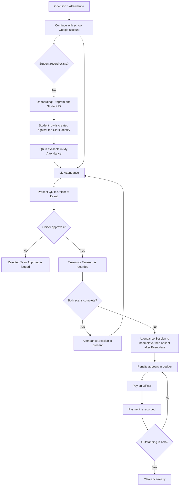

# Student User Flow

## Scope

A Student signs in with their school Google account, presents a QR at Events, and tracks Attendance Sessions, Penalties, Payments, and Clearance readiness on the responsive web app.

## Sign-in and onboarding

1. Open `/sign-in` and continue with an `@gbox.ncf.edu.ph` Google account. The same route serves first-time and returning people; there is no separate register page and no password.
2. A signed-in person with no Student row is a Pending Student and is sent to `/onboarding`.
3. Enter Program and Student ID. Name and email come from the verified Google identity.
4. The system validates the Governor-managed Program list, creates the Student row against the Clerk user id, and redirects to My Attendance, where the QR is already available.
5. Returning Students go straight to `/dashboard`, which forwards a Student to `/my-attendance`.

## Daily use

1. After sign-in, `/dashboard` redirects a Student to `/my-attendance`.
2. The Student can:
   - display or download the QR;
   - view the open Semester's total and outstanding Penalties;
   - view Attendance Session status; and
   - view Payment history.
3. At an Event, the Student presents the QR for the Officer-selected Time-in or Time-out mode.
4. The Officer compares the Scan Approval details with the Student's worn school ID and approves or rejects. Unreadable QR data or a Student ID/name/Program mismatch cannot be approved.
5. A completed Attendance Session requires both Time-in and Time-out.

## Penalty and Clearance outcomes

- Missing either scan makes the Attendance Session incomplete on the Event date and absent afterward.
- A whole-day Event evaluates AM and PM separately.
- A late onboarder owes for all Events in a Semester that had not ended before their record was created.
- Penalties are system-computed, not manually entered.
- Payments are recorded by an Officer and settle a Penalty in full.
- The Student is Clearance-ready only when the open Semester's outstanding balance is zero.

## Exceptions

| Situation | Outcome |
| --- | --- |
| Invalid Program or Student ID | Onboarding remains on the form with validation feedback |
| Email or Student ID already taken | Onboarding reports the conflict and the person stays a Pending Student |
| Missing Time-in or Time-out | Attendance Session remains incomplete/absent until corrected |
| No open Semester | My Attendance shows no current Penalty standing |
| QR is rejected | No Attendance Session changes; the decision is retained for Governor review |
| QR details differ from the current Student | Approval is disabled and the attempt is retained as a rejection |
