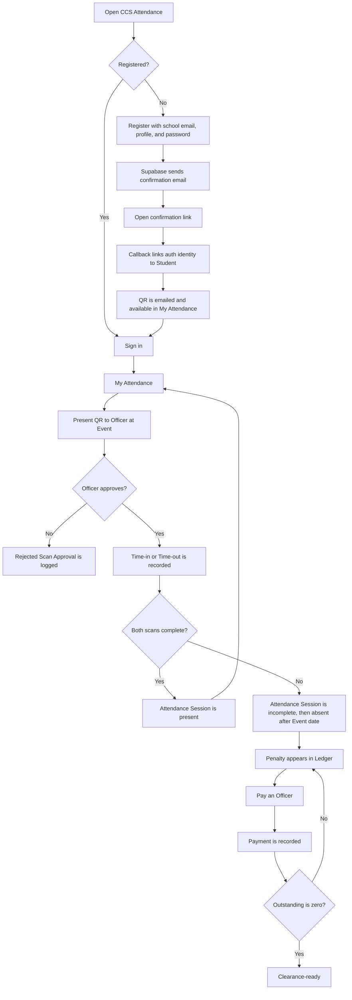

# Student User Flow

## Scope

A Student self-registers, proves ownership of a school email, presents a QR at Events, and tracks Attendance Sessions, Penalties, Payments, and Clearance readiness on the responsive web app.

## Registration and sign-in

1. Open `/register`.
2. Enter an `@gbox.ncf.edu.ph` email, name, Program, Student ID, and matching password of at least eight characters.
3. The system validates the Governor-managed Program list and creates:
   - a Supabase password account; and
   - a Student row that is not linked until email confirmation.
4. Open the Supabase confirmation email.
5. `/auth/callback` links the Supabase identity to the Student row and sends a QR attachment through Resend.
6. Sign in at `/login`. An unconfirmed account can request another confirmation email.

If the password is forgotten, `/forgot-password` sends a reset link without revealing whether the email is registered. The link returns through `/auth/callback?next=/reset-password`.

## Daily use

1. After sign-in, `/dashboard` redirects a Student to `/my-attendance`.
2. The Student can:
   - display or download the QR;
   - view the open Semester's total and outstanding Penalties;
   - view Attendance Session status; and
   - view Payment history.
3. At an Event, the Student presents the QR for the Officer-selected Time-in or Time-out mode.
4. The Officer compares the Scan Approval details with the Student's worn school ID and approves or rejects. Unreadable QR data or a Student ID/name/Program mismatch cannot be approved.
5. A completed Attendance Session requires both Time-in and Time-out.

## Penalty and Clearance outcomes

- Missing either scan makes the Attendance Session incomplete on the Event date and absent afterward.
- A whole-day Event evaluates AM and PM separately.
- A late registrant owes for all Events in a Semester that had not ended before registration.
- Penalties are system-computed, not manually entered.
- Payments are recorded by an Officer and settle a Penalty in full.
- The Student is Clearance-ready only when the open Semester's outstanding balance is zero.

## Exceptions

| Situation | Outcome |
| --- | --- |
| Invalid Program, email, or password | Registration remains on the form with validation feedback |
| Email already linked | Student is directed to sign in |
| Email exists but is unconfirmed | Confirmation email is resent and profile fields are refreshed |
| Missing Time-in or Time-out | Attendance Session remains incomplete/absent until corrected |
| No open Semester | My Attendance shows no current Penalty standing |
| QR is rejected | No Attendance Session changes; the decision is retained for Governor review |
| QR details differ from the current Student | Approval is disabled and the attempt is retained as a rejection |
