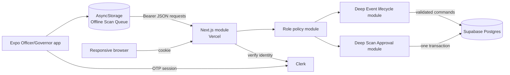

# CCS Attendance

## Current System Design

| Field | Value |
| --- | --- |
| Status | Approved refactor design; implementation pending |
| Owner | Not recorded in the repository |
| Last updated | July 31, 2026 |
| Authors | Not recorded in the repository |
| Reviewers | Not recorded in the repository |
| Related docs | [Architecture](./architecture.md), [Deployment](./deployment.md), [Domain model](../CONTEXT.md), [ADRs](./adr/) |
| Scope | Current web, mobile, authentication, attendance, Penalty, Payment, Clearance-readiness, and deployment design |

## 1. Abstract

CCS Attendance is a QR-based attendance and Penalty system for the College of Computer Studies. A responsive Next.js web module supports Students, Officers, and Governors; an Expo mobile module supports booth scanning and shared Event management; Clerk provides identity for both clients and Supabase provides Postgres; Drizzle owns typed application data access.

The target guarantees are capability authorization inside deep command modules, strict client-UUID idempotency, atomic Scan Approval persistence, deterministic earliest Time-in/latest Time-out resolution, protected Event history, one Attendance Session per Event/Student/half, automatically derived Penalties, and one full Payment per Penalty. The Ledger remains the deep read module that keeps no-show and standing rules local across Student, Clearance, and operations views.

The system targets one College department and one Asia/Manila calendar. Repository evidence does not define traffic targets, SLOs, data retention, disaster-recovery objectives, or multi-tenant isolation. Native mobile distribution is also not automated in the repository.

## 2. Goals and Non-Goals

| Goals | Non-goals |
| --- | --- |
| Replace paper Event sign-in with QR Time-in/Time-out | Multi-tenant operation across independent institutions |
| Derive per-Session Penalties and outstanding standing consistently | Partial Payment or installment accounting |
| Continue capturing booth decisions while temporarily offline | Fully offline Event administration or authentication |
| Enforce Student, Officer, and Governor roles server-side | Per-Officer Event ownership |
| Support Student web use and Officer/Governor web/mobile work | Native Student experience |
| Keep migrations and releases repeatable | Automatic database rollback |
| Preserve Event attendance and financial history | Officer demotion or queue handoff |

## 3. Background and Problem Statement

Paper sign-in sheets do not reliably establish whether a Student completed both Time-in and Time-out, make per-Session Penalties expensive to reconcile, and provide no consistent Clearance standing. The system replaces the paper process with a self-contained Student QR, Officer Scan Approval, durable scan delivery, typed attendance records, and a shared Ledger projection.

The system seam is the deployed Next.js module. Browsers cross it through pages and server actions with session cookies; the native app crosses it through `/api/*` routes with a Clerk session token as a Bearer credential. Mobile never talks to Supabase directly. The web implementation owns all application-table reads and writes through Drizzle.

The guiding invariant is: one attendance rule and one Penalty rule must serve every user-facing projection. `computeLedger` and `syncPenaltyForSession` provide this locality.

## 4. Proposed Architecture

The architecture below describes the current implementation, not a future replacement.

Figure 1. Current system architecture.

### Core modules

| Module | Responsibility | Primary storage/dependency | Failure behavior |
| --- | --- | --- | --- |
| Next.js delivery module | Render role surfaces and accept web/mobile commands | Vercel runtime | Failed requests return/throw; no repository-wide fallback |
| Authentication module | Map external identities to Students — Clerk on both clients | Clerk and `students` | Missing/invalid identity is unauthenticated; privileged access fails closed |
| Event lifecycle module | Own create/update/delete capability, Semester, lifecycle, and persistence rules | Postgres | Rejects invalid transitions without changing Event history |
| Scan Approval module | Own validation, strict idempotency, canonical Student matching, atomic attendance resolution, and Penalty synchronization | `scans`, `attendance_sessions`, `penalties` | Any write failure rolls back; conflicting UUID reuse returns `409` |
| Offline Scan Queue | Retain Officer-owned decisions, retry temporary failures, and isolate permanent failures | AsyncStorage | Pending work survives restart; Needs Review does not block later delivery |
| Role policy module | Map roles to capabilities and enforce command access | In-process policy | Missing identity fails as `401`; denied capability fails as `403` |
| Ledger module | Compute Student standing and Event/Semester projections | Postgres rows loaded through Drizzle | Read fails with its request; full no-shows remain virtual until Payment needs rows |

### Module interfaces

- Scan Approval exposes one command that accepts the authenticated actor and one approve/reject decision.
- Event lifecycle exposes three commands: create, update, and delete. Listing remains a read query.
- Offline Scan Queue exposes enqueue, synchronize, discard, and read state. Recent Scans remains a separate five-item local read model.
- Role policy exposes one capability predicate for display and one required-capability check for commands.

### Refactor scope exclusions

- Mobile Payment UI and desktop viewport gating remain separate product/UX work.
- Clearance reports whether the physical paper may be signed; no digital Clearance record is added.
- Officer demotion remains outside the domain until safe device-queue handoff is required.
- Background mobile-task infrastructure and QR signing are not included.
- Supabase Storage remains unused by the current source.

## 5. Request Lifecycle

### Browser request

1. Next.js proxy resolves the Clerk session and redirects an unusable one to `/sign-in` or `/onboarding`.
2. The page or server action loads the current Clerk user.
3. The authentication module maps `auth.users.id` to `students.auth_user_id`.
4. A role guard authorizes Student, Officer/Governor, or Governor access.
5. Drizzle loads or mutates application state.
6. The response renders or redirects. The sidebar identity cache affects display only.

### Approved mobile scan

1. Officer selects an Event and booth mode.
2. Camera captures the QR and the device timestamp.
3. The app decodes the display details and asks for Scan Approval.
4. Approval is stored in AsyncStorage with a client UUID.
5. Queue delivery sends the decision with a Clerk session token.
6. The authentication adapter resolves the actor; the Scan Approval module requires the scan capability.
7. The module validates Event, booth mode, QR shape, and exact Student ID/name/Program match.
8. One transaction binds the UUID to the unchanged decision, stores the Scan, resolves earliest Time-in/latest Time-out, and synchronizes the Penalty.
9. An identical retry returns the completed result; different content with the same UUID returns `409 Conflict`.
10. A successful response lets the mobile queue delete the decision. Temporary failures remain pending; permanent failures move to Needs Review.

### Rejected mobile scan

1. Capture, approval display, queueing, authentication, and validation follow the same entry path.
2. The Scan Approval module records a rejected Scan by UUID. Unreadable or non-canonical QR approval attempts become rejections.
3. No Attendance Session or Penalty changes.
4. The Governor can search and sort the rejection later.

## 6. API and Data Contracts

### Mobile route inventory

| Method and path | Caller | Purpose |
| --- | --- | --- |
| `GET /api/me` | Mobile | Return authenticated Student identity |
| `GET /api/events/mine` | Mobile | Return all shared Events and Attendance Session row counts |
| `POST /api/events` | Mobile | Create an Event in the open Semester |
| `PATCH /api/events/:id` | Mobile | Edit an Event |
| `DELETE /api/events/:id` | Mobile | Hard-delete an Event and cascaded records |
| `POST /api/scan/approve` | Mobile queue | Persist an approved Scan and attendance effect |
| `POST /api/scan/reject` | Mobile queue | Persist a rejected Scan |
| `GET /api/identity` | Browser sidebar | Return cookie-authenticated display identity |

All mobile application routes require `Authorization: Bearer <Clerk session token>`.

### Primary scan-decision contract

| Field | Type | Required | Description |
| --- | --- | --- | --- |
| `scanId` | UUID string | Yes | Client-generated idempotency identifier |
| `eventId` | UUID string | Yes | Existing shared Event |
| `mode` | enum string | Approval only | Time-in/out for AM/PM |
| `qrPayload` | JSON string | Yes | Self-contained name, Student ID, and Program |
| `scannedAt` | ISO date-time string | Yes | Device capture time, not server receipt time |

### Contract guarantees

- A repeated `scanId` does not insert a second Scan.
- One `scanId` is permanently bound to one unchanged decision; conflicting reuse returns `409`.
- One Attendance Session row is allowed per Event, Student, and half.
- One Penalty is allowed per Attendance Session.
- One Payment is allowed per Penalty.
- The server, not the decoded mobile display, resolves the Student from the QR Student ID.
- No versioned public schema or OpenAPI document currently exists.

## 7. Consistency, Idempotency, and Replay

| Scenario | Expected behavior | Reasoning |
| --- | --- | --- |
| Duplicate identical scan delivery | Return the completed result without changing attendance again | UUID identifies one immutable Scan Approval decision |
| Duplicate UUID with different content | Return `409 Conflict` | Prevents silent idempotency-key reuse |
| Duplicate Payment submit | Keep one Payment | Unique `payments.penalty_id` plus conflict ignore |
| Duplicate no-show materialization | Keep one Attendance Session/Penalty per required half | Unique constraints plus conflict ignore |
| Mobile network/timeout/`429`/`5xx` failure | Retain pending decision and retry with bounded backoff | Temporary delivery failure must not lose capture-time truth |
| Permanent decision failure | Move to Needs Review and continue later delivery | One bad decision must not block the queue |
| Approved scan partial database failure | Roll back every Scan/Attendance/Penalty write | One transaction defines delivered success |
| Manual attendance correction | Recalculate Penalty; keep a paid Penalty | Payment referential integrity takes precedence |
| Event delete | Cascade-delete Event attendance and financial trail | Database foreign-key cascades |
| Concurrent open-Semester creation | Reject the later write | Postgres enforces at most one open Semester |
| Out-of-order approved booth decisions | Keep earliest Time-in and latest Time-out | Resolution is independent of delivery order |

Ledger reads are internally consistent for the rows loaded into `computeLedger`, but the repository defines no snapshot-isolation guarantee across its separate loading queries.

## 8. Security and Privacy Considerations

- Privileged commands enforce capabilities inside their deep module. Client navigation is not an authorization control.
- Clerk publishable keys are public client configuration; `DATABASE_URL`, `CLERK_SECRET_KEY`, and any service-role key must remain server-only.
- The QR contains Student name, Student ID, and Program in unsigned plaintext JSON. Treat QR images and raw rejection payloads as personal data.
- Scan Approval requires an Officer to visually compare the Student with a worn school ID.
- No password is collected, transmitted, or stored anywhere in the system; identity on both clients is Google SSO through Clerk.
- The database is accessed by the server through Drizzle; clients do not query application tables directly.
- Repository policy does not define data retention, deletion requests, backup access, log redaction, or QR rotation.
- Governor assignment depends on `GOVERNOR_EMAILS` at first confirmation. Governors inherit Officer mobile capability under ADR-0010.
- Mobile verifies identity after login and admits only Officers or Governors before rendering booth tabs.

## 9. Operational Readiness

| Signal | SLO or alert | Owner | Launch gate |
| --- | --- | --- | --- |
| Web build and static checks | No SLO defined | Not recorded | Required |
| Web unit tests | No pass-rate SLO beyond all passing | Not recorded | Required |
| Unauthenticated route behavior | `/api/events/mine` must return JSON `401`, not Vercel SSO | Not recorded | Required |
| Mobile scan sync | No latency/error SLO defined | Not recorded | Physical-device smoke test required |
| Database migration state | Committed migrations must report successful application | Not recorded | Required |
| Scan/Event consistency | Disposable Postgres integration checks pass | Not recorded | Required |
| Backup/recovery integrity | No RPO/RTO or restore cadence defined | Not recorded | Recommended before production |

Rollout constraint: apply required database migrations before code that depends on them; deploy web from `main`; rebuild mobile when any `EXPO_PUBLIC_*` value changes; smoke-test role isolation and scan sync. Web rollback promotes the previous Vercel deployment. Mobile rollback rebuilds a known-good commit. Database rollback is forward-fix only.

## 10. Alternatives Considered

| Alternative | Why it was considered | Why it was not selected |
| --- | --- | --- |
| Bare React Native | Full native control | More toolchain overhead than the booth workflow needs |
| Supabase Data API for application tables | Direct client data access | Would duplicate authorization and replace typed Drizzle queries |
| Magic-link-only authentication | Low password-management burden | Repeated use fits a standing credential better |
| Multi-day Event entity/date range | Model workshops as one record | Adds per-day attendance complexity without a current reader |
| Per-Officer Event ownership | Restrict Event access | Officers operate as one interchangeable pool |
| Store aggregate whole-day Penalty | Simplify display | Two per-half Penalties already sum to the correct result |

See `docs/adr/` for the retained decision records.

## 11. Open Questions

1. Who owns production incidents, Supabase backups, restore tests, and secret rotation?
2. What availability, scan-sync latency, recovery, and data-retention targets are required?
3. How will production mobile builds be signed, distributed, promoted, and rolled back?
4. Should QR payloads be signed, minimized, or rotated in a later security change?

## 12. Decision and Next Steps

Retain the current Vercel + Supabase + Expo topology and implement the approved deep modules in dependency order. Server correctness lands before the mobile queue depends on its response contract.

| Milestone | Deliverable | Exit criteria |
| --- | --- | --- |
| M1 | Disposable Postgres checks and central role policy | Capability behavior and real constraints are runnable without production data |
| M2 | Transactional Scan Approval command | Forced mid-write failure retries to one complete Scan/Attendance/Penalty outcome |
| M3 | Event lifecycle commands and constraints | Web/mobile share rules; protected history and one-open-Semester invariant pass |
| M4 | Officer-owned Offline Scan Queue and mobile role gate | Temporary/permanent failures, logout blocking, Recent Scans, and role admission pass on device |
